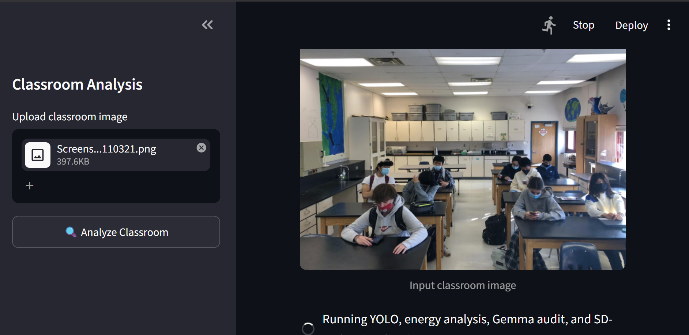
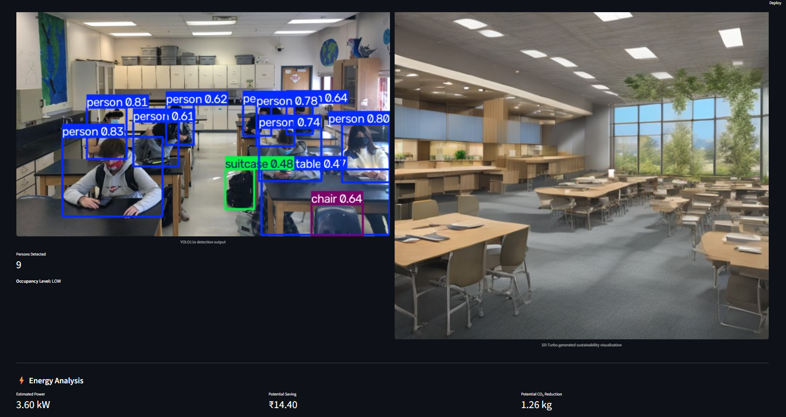
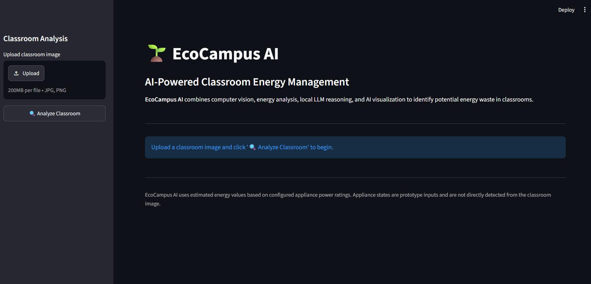
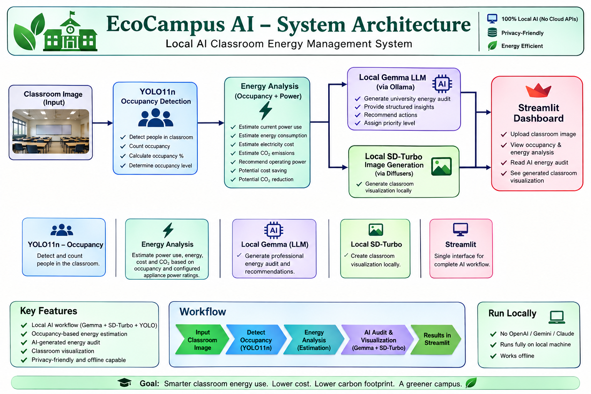
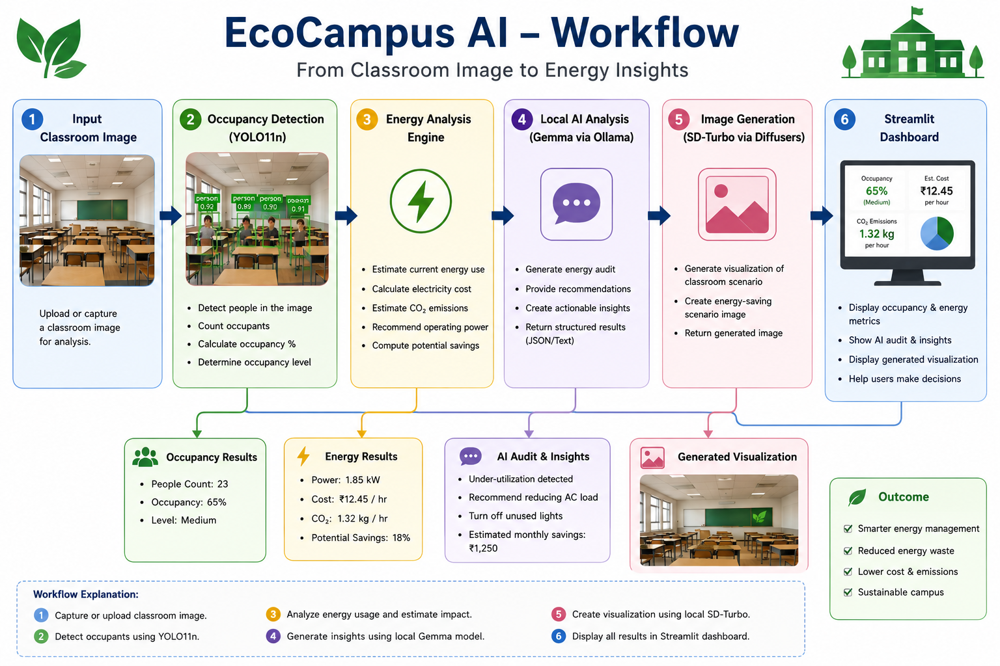

# EcoCampus AI

## Local AI Classroom Energy Management System

EcoCampus AI is a university-focused local AI application designed to identify classroom occupancy and estimate unnecessary energy consumption.

The system combines computer vision, a local Large Language Model (LLM), local image generation, and a Streamlit interface in a single workflow.

The application is designed to run locally without using cloud AI APIs such as OpenAI, Gemini, or Claude.

---

## 1. Problem Statement

University classrooms may consume electricity through lighting, fans, air conditioning, and other equipment even when occupancy is low or the classroom is empty.

Manual monitoring of classroom occupancy and energy usage can be inefficient and difficult to scale across multiple classrooms.

EcoCampus AI addresses this problem by analyzing a classroom image using YOLO-based computer vision, estimating occupancy-based energy usage, generating a local AI energy audit using Gemma, and producing a visual representation using a local Stable Diffusion Turbo model.

The goal is to provide a simple AI-assisted decision-support system for university facility and energy management.

---

## 2. Objectives

- Detect people present in a classroom image.
- Estimate classroom occupancy.
- Estimate current classroom energy consumption.
- Estimate potential electricity cost savings.
- Estimate potential CO2 reduction.
- Generate a professional energy audit using a local LLM.
- Generate a visual classroom representation using a local image generation model.
- Provide all results through a single Streamlit application.
- Keep the complete AI workflow runnable locally.

---

## 3. Key Features

### YOLO11n Occupancy Detection

The system uses YOLO11n to detect people in the classroom image.

The detected number of people is used to calculate:

- Occupancy percentage
- Occupancy level
- Energy-use recommendation
- Priority level

### Occupancy-Based Energy Analysis

The energy analysis module estimates:

- Current appliance power
- Current energy consumption
- Estimated electricity cost
- Estimated CO2 emissions
- Recommended operating power
- Recommended energy consumption
- Potential cost saving
- Potential CO2 reduction

The energy values are estimates based on configured appliance power ratings and are not direct smart-meter measurements.

### Local Gemma Energy Audit

Gemma is accessed locally through Ollama.

The LLM receives the occupancy and energy-analysis results and generates a structured university energy audit containing:

1. Occupancy Assessment
2. Energy-Waste Observation
3. Estimated Energy and Cost Impact
4. Recommended Actions
5. Priority Level

### Local SD-Turbo Image Generation

The application uses a local Stable Diffusion Turbo model to generate a classroom visualization.

The generated image is produced locally using the Diffusers library.

### Streamlit Dashboard

The complete workflow is accessible through a Streamlit interface.

The dashboard allows a classroom image to be submitted and displays the analysis results and generated outputs.

---

## 4. Important System Design Note

YOLO is used for occupancy detection only.

The appliance states for lighting, fans, air conditioning, and projector are configured prototype inputs used by the energy-analysis engine.

They are not detected from the classroom image.

Similarly, electricity consumption is estimated from configured appliance power ratings rather than measured using a physical smart meter.

This distinction keeps the prototype's outputs transparent and reproducible.

---

## 5. System Architecture

```text
                    ┌─────────────────────┐
                    │   Classroom Image   │
                    └──────────┬──────────┘
                               │
                               ▼
                    ┌─────────────────────┐
                    │      YOLO11n        │
                    │ Occupancy Detection │
                    └──────────┬──────────┘
                               │
                               ▼
                    ┌─────────────────────┐
                    │   Energy Analysis   │
                    │                     │
                    │ Occupancy + Power   │
                    │ Cost + CO2 Estimate │
                    └───────┬───────┬─────┘
                            │       │
                  ┌─────────┘       └──────────┐
                  ▼                            ▼
        ┌──────────────────┐        ┌────────────────────┐
        │ Local Gemma LLM  │        │ Local SD-Turbo     │
        │     Ollama       │        │ Image Generation   │
        └────────┬─────────┘        └─────────┬──────────┘
                 │                            │
                 ▼                            ▼
        ┌──────────────────┐        ┌────────────────────┐
        │ Energy Audit     │        │ Generated Classroom│
        │ Report           │        │ Visualization      │
        └────────┬─────────┘        └─────────┬──────────┘
                 │                            │
                 └────────────┬───────────────┘
                              ▼
                    ┌─────────────────────┐
                    │ Streamlit Dashboard │
                    └─────────────────────┘
```

---

## 6. Installation

### Prerequisites

The following software is required:

- Python 3.11
- Git
- Ollama
- A local Gemma model
- Sufficient system resources for local Stable Diffusion Turbo image generation

### Clone the Repository

```bash
git clone https://github.com/CHRIST-SDS/2582446_EcoCampus_AI.git
cd 2582446_EcoCampus_AI
```

### Create and Activate the Virtual Environment

```bash
python -m venv .venv
```

Activate the virtual environment on Windows Git Bash:

```bash
source .venv/Scripts/activate
```

### Install Python Dependencies

```bash
pip install -r requirements.txt
```

### Set Up the Local Gemma Model - The project uses Gemma through Ollama.

```bash
ollama pull gemma3:4b
```

## 7. Usage

After completing the installation and ensuring Ollama is running with the required Gemma model, start the Streamlit application:

```bash
streamlit run app.py
```


The Streamlit dashboard allows the user to upload a classroom image and run the complete local AI workflow.

The workflow performs:

1. YOLO11n-based classroom occupancy detection.
2. Occupancy-based energy analysis.
3. Local Gemma energy audit through Ollama.
4. Local Stable Diffusion Turbo image generation.
5. Display of the analysis and generated visualization in the Streamlit dashboard.

## 8. Screenshots

### Dashboard



### Classroom Analysis



### Dashboard Before Analysis



---

## 9. Architecture



## 10. Workflow



## 11. Demo Video

The project demonstration video is available in:

`demo/demo.mp4`

## 12. Project Outcome

EcoCampus AI demonstrates how multiple local AI technologies can be integrated into a single university-focused application.

The system combines:

- Computer vision for classroom occupancy detection.
- Rule-based energy estimation for energy analysis.
- A local Gemma LLM for natural-language energy auditing.
- A local Stable Diffusion Turbo model for visual generation.
- Streamlit for an integrated user interface.